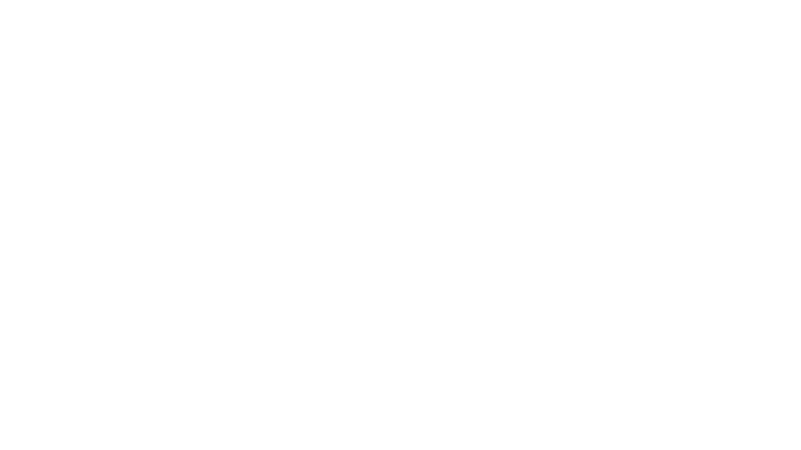

[//]: # (<div style="width: 1000px; height: 1000px; overflow: hidden;">)


[//]: # (</div>)

# Enigma Simulator
> [!NOTE]
> This is a project work at my university. This work took place as part of an "Enigma Rebuild Project". 
> I've done my best to make this cross-platform compatible. 

> [!IMPORTANT]  
> Many thanks to Arif Hasanic for entrusting me with this project. Link to his GitHub Repository: https://github.com/murderbaer/enigma

## Third-Party Libraries

- **cjson**: MIT License
  - License: [https://github.com/DaveGamble/cJSON/blob/master/LICENSE]
- **GTK-3.0**: GNU General Public License (GPL)
  - License: [https://github.com/GNOME/gtk/blob/main/COPYING]

## Quickstart

### Install necessary dependencies

#### Run install_deps.sh or manually:

```bash
# arch
sudo pacman -S gtk3
sudo pacman -S pkg-config

# debian based
sudo apt install libgtk-3-dev
sudo apt install pkg-config

# MinGW (Windows)
pacman -S mingw-w64-x86_64-gtk3
(optional) pacman -S mingw-w64-ucrt-x86_64-toolchain base-devel
pacman -S mingw-w64-x86_64-pkg-config

# macOs (homebrew), you may need to install homebrew first (https://brew.sh/)
brew install gtk+3
brew install pkg-config
```
If you are on Mac and get an error that `cjson` try adding the homebrew library path to your `.zshrc` or `.bashrc` file:
```bash
export LDFLAGS="-L/opt/homebrew/lib"
export CPPFLAGS="-I/opt/homebrew/include"
```
It should work without this as there already is a condition in the `CMakeLists.txt` file that checks for the homebrew path.

### Build the project

This project uses CMake as its build system. To build the project first make sure you have CMake installed. Then run the following commands:

```bash
mkdir build
cd build
cmake ../enigma_c
cmake --build .
```
> [!NOTE]
> I've done my best to make this project cross-platform and even ditched the C23 standard because its no fully supported yet.
> Sadly I don't have access to a macOS system like my predecessor. So I can't fully guarantee macOS support. But im working on it.  

This will create a binary called `enigma` and `enigma_test` in the `build/bin` directory. Running `enigma -h` will show you how to use the program. If you never used CMake before, an explanation of the commands is given [here](docs/CMakeLists.md).
