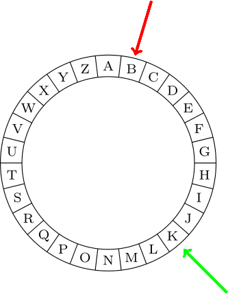

# Enigma Implementation

## Rotor

The Rotors are currently predefined and hardcoded as a string.
A shortened example of this string would be "CDAB".
'A' would be converted to 'C', as the letter C is in the first (A) position.
'B' would be converted to a 'D', 'C' to 'A' and 'D' to 'B'.

To recreate the behavior of a rotor, it first needs to be broken down.
The base idea is that if I have a letter 'X' as the input, I get another letter 'Y' as the output.
This behavior needs to exist for every letter in the alphabet.
The most obvious approach would be to create some sort of map like:
'A' ⇒ 'C', 'B' ⇒ 'D', 'C' ⇒ 'A', 'D' ⇒ 'B'.

Where the left value is the input and the right value is the output.
A similar approach was used.
First, the Rotor string definition and the text to decrypt were converted to integer arrays.
Using the short example from above the array would look like `[2,3,0,1]`.
If `ABC` was chosen as the text to encrypt, the corresponding int array would look like `[0,1,2]`.
Those conversions are relative simple operations,
as in C a string is just a char array and a char is just a short that can be used for calculation.

```C
uint8_t* get_int_array_from_string(const char *str)
{
    if (str == NULL) return NULL;
    const size_t len = strlen(str);
    uint8_t *array   = malloc(len * sizeof(uint8_t));
    assertmsg(array != NULL, "array == NULL");

    for (size_t i = 0; i < len; i++)
    {
        array[i] = str[i] - 'A';
    }

    return array;
}
```
The above example ist the code on how those conversions are made.
'A' is an ASCII encoded character,
and its numerical value is 65. So if `str[i]` equals to `A` the value in `array[i]` would be 0.
'B' would result in 1, etc.

> [!NOTE]
> One condition to the code is that all letters have to be uppercase. If any extensions to the project are made, please keep this in mind.
> There is a `to_upper_case` method which should be used before.
>
> I've carefully "normalized" and "sanitized" all inputs before use.

The big advantage to this approach is
that now the index of the rotor array is the input and the containing value of the output.
The input string is the int array the text input (`[0,1,2]`).
Each element of the array is one index for the rotor,
so looping through the entire array and using the values as the index value for the rotor will return an encoded value.
The enigma uses multiple rotors,
so instead of returning the encoded value immediately, it will pass other rotors before returning back to the user.

As C also does not have a native Map structure, the implementation of one is now not necessary.
Also,
getting an item from an array should always be faster than from a Map as it doesn't really get any simpler than that.

The last important thing understands how to rotate the rotors.
As they are represented as an int array, the first solutions could be to just shift the array.
Although possible, this would require entering a for loop for each letter (26 times) and for each rotation.
For smaller texts, this would not be a problem,
but especially for the cyclometer where over 100.000 configurations would need to be tested,
the impact would be noticeable.

Instead of rotating the array, a rotor position was introduced. This position is increased before a letter is being encrypted and is being applied to the letter by subtracting it.
```c
for (uint16_t i = 0; i < array_size; i++)
{
    rotorOne->position = (rotorOne->position + 1) % 26;
    ...

    uint8_t character = traverse_rotor(rotorOne, text[i]);
    ...
    character         = reflector->wiring[character];
    ...
    character         = traverse_rotor_inverse(rotorOne, character);
}

uint8_t traverse_rotor(const Rotor *rotor, const uint8_t character)
{
    const uint8_t index_from_right = mod26(character + rotor->position);
    const uint8_t index_from_left  = mod26(rotor->wiring[index_from_right] - rotor->position);

    return index_from_left;
}
```
This is the method for traversing the rotor from left to right. It first calculates the `index_from_right` for retrieving the index of the character which the character parameter gets mapped to.
Here we must adjust for the rotation because the rotors get rotated before each keypress.

After we calculated the correct index (`index_from_right`)
we simulate the internal wiring with `rotor->wiring[index_from_right]`.
Then we need to adjust the index one more time because as of now, the rotor "hasn't rotated."

---

**Example:**

Suppose we want to encrypt `"AAAAAA"`:

`"AAAAAA"` is now processed by `get_int_array_from_string` to `[0, 0, 0, 0, 0, 0]`.
After the first "keypress" the rotor is at position 1 or 'B'.
So now `traverse_rotor` receives a rotor with position 1 and character 0.

`index_from_right` is calculated to be 1 in this case. The wiring for the character 'B' or index 1 is looked up as it is the current position of the rotor.
But we must keep in mind that we've never actually "rotated the rotor" so now we've permuted the character correctly, but the index is now actually n places too far. So we must subtract the position again.
 <div style="text-align: center;">
  
 </div>

The red arrow is the `index_from_right` and green the arrow is the result of `rotor->wiring[index_from_right]` so we must adjust the index because in a real Enigma the letter 'B' would now be on top.

---

The inverse method looks very similar,
but left and right indizes are swapped and the lookup happens in the `rotor->inverse_wiring` array.

`mod26` is an inline function that makes sure all values are >= 0 and < 26. It does so by adding 26 to the argument and applying % 26 afterward.
This approach was taken for speed purposes as branching is relatively slow.

## Reflector
The Reflector basically works the same as a Rotor, but it doesn't rotate.

## Plugboard
The plugboard is defined as pairs of char which represent the letters to switch 'AB CD'.
Some checks are done so no invalid options are allowed ('AB AC' is not valid).
At first, an array with 26 entries is defined.
Each cell holds its index as its value.
If the plugboard is defined correctly,
the array will be modified by switching the index values in the cells according to the definition.
Example:
```C
[0,1,2,3,4,5] // initially
[1,0,3,2,4,5] // A and B switch positions and C and D too
```
As the input is also an int array, each element of that array is being sent through the plugboard_array,
possibly being modified.
This happens two times for each complete enigma encryption.
Firstly, before going through the rotors and afterward. 