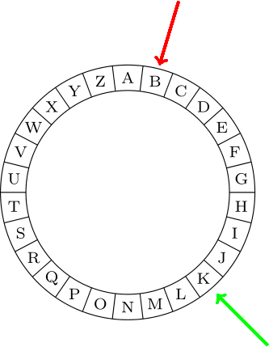

# Enigma

## Preface

The Enigma-Machine is a cipher device developed in the early 20th century.
It was primarily used in the second world war by the german army to encrypt/decrypt messages.
Most Enigmas where equipped with three rotors and a plugboard,
although variants with four rotors where built at the end of the second world war.
This implementation supports Enigmas with three and four rotors.

## Design

### Rotor 

Each rotor of the Enigma performed a mono alphabetic substitution, which is nothing else than a letter substitution.

#### Wiring

Here is the wiring of the Rotor I:

| A | B | C | D | E | F | G | H | I | J | K | L | M | N | O | P | Q | R | S | T | U | V | W | X | Y | Z |
|---|---|---|---|---|---|---|---|---|---|---|---|---|---|---|---|---|---|---|---|---|---|---|---|---|---|
| E | K | M | F | L | G | D | Q | V | Z | N | T | O | W | Y | H | X | U | S | P | A | I | B | R | C | J |

When current is applied to the letter 'A' at the rotor input, the internal wiring substitutes it to the letter 'E'.
Because a substitution cipher is very unsafe, we permute the rotor postion by rotating it with each keypress.
So next time we press an 'A'
the input contact is still at the same place, but now the rotor has advanced forward one place. 
The current of the letter 'A' now takes the path of the rotor letter 'B'. 
The rotation takes place before each keypress.
So if the starting position of the rotor was to be 'A',
and we were to encrypt the letter 'A', it would actually take the path of 'B'.

Because this is still not secure enough, an Enigma was typically equipped with three rotors. 
They rotated according to the scheme of a mechanical odometer or like the pointers of a clock.
So if a rotor has made a complete advance, the rotor left to it advances forward one place.

#### Ring Setting

The turning point could also be set through the "Ring Setting".
It changed the relation of the internal wiring to the outer visible letters.
It also rotated a notch, which was responsible for turning the next rotor over. 

There was an anomaly in the turning procedure:
If the left most rotor (the slowest) advanced one step forward, it always took the middle one with it. 
Meaning all rotors rotated at the same time.

#### Reflector

As a final complication, each Enigma did have a "Reflector".
A special kind of Rotor
that never rotated but also performed a letter substitution and redirected the current back in rotors again.

#### Current path

So the current passed through the rotors twice:
the first time from right to left in the reflector and then from left to right.

A three-rotor Enigma had a total of five possible rotors available,
and the four rotor variants had a total of 8 available. 

## Secure enough?

The first commercial Enigmas where equipped without a plugboard, which is discussed latter.
The german army asked itself the question: How secure is the Enigma?

So let's calculate how secure an Enigma without a plugboard is:

The number of possible rotor arrangements for a three-rotor Enigma is:

$$
P(5, 3) = \frac{5!}{(5-3)!} = 60 \text{ Rotor Permutations}
$$

Combined with the 26 possible positions of each rotor:

$$
26^3=17.576 \cdot 60 = 1.054.560 \text{ Theoretical Combinations}
$$

Although $1.054.560$ combinations seem like a large number,
it is a very, very small number in cryptology terms and with the help of machines even in 1939 "bruteforce-able".


### Plugboard

The german army realized this problem too, so they added the "Plugboard".
It consisted of 26 "plug holes" one for each letter.
A typical Enigma was equipped with 10 plugboard cables.
This plugboard also performs a letter substitution and has commutative properties meaning:
Plugging the 'A' and 'B' is the same as plugging 'B' and 'A'.

So let's calculate the combinations:

$$
\frac{26!}{6!\cdot 10!\cdot 2^{10}} = 150.738.274.937.250
$$

$26!$ are the possible permutations of the alphabet meaning in how many ways we can arrange 26 letters.

Because there were typically only 10 plugboard cables provided, and each of them formed a pair, there were six letters leftover.
Meaning we must divide by $6!$.

Because the order of these ten pairs doesn't matter, we divide by $10!$.

And lastly, we must pay attention to the commutative properties of the plugboard.
Because we have ten cables, the number of combinations we must rule out is $2^{10}$.

To calculate the actual number of combinations, we must consider the anomaly described in "Ring Setting":

To rule out these anomalies, we must first calculate the number of ring settings:

$$
26^2=676 \text{ Ring Positions}
$$

Why $26^2$?
Because the notch of the ring setting of the left most rotor doesn't rotate any other rotors,
we must only calculate the combinations for two of these rotors.

There were only 26 positions in which the above-described anomaly didn't occur,
so we must eliminate the following combinations:

$$
26^2−26 = 650 \text{ Redundant Positions}
$$

So the actual number of possible combinations is:

$$
26^3–650 = 16.926 \text{ Actual Rotor Positions}
$$

The resulting number is hard to comprehend:

$$
60 \cdot 676 \cdot 16.926 \cdot 150.738.274.937.250 = 103.484.623.446.804.960.360.000 \text{ Actual Combinations}
$$

In words:
one hundred three sextillion four hundred eighty-four quintillion six hundred twenty-three quadrillion four hundred 
forty-six trillion eight hundred four billion nine hundred sixty million three hundred sixty thousand combinations.

Or roughly $10^{23}$ combinations.
It should be apparent that this is not "bruteforce-able".
The key length is about 76 bits, which for the time was enormous and is quite impressive even today.
The wildly used encryption algorithm [DES](https://en.wikipedia.org/wiki/Data_Encryption_Standard) has comparatively small 
key length of only 56 bits.
Although key length is not a maxime for security,
because a mono alphabetic substitution has a key length of 88 bits and is much unsafer, it gives a rough direction.

## This has to be Secure enough! Right?

All that glitters is not gold.
This enormous key length isn't what the allies needed to break.
Because the plugboard just performs a mono alphabetic substitution
and doesn't change during the whole encryption process,
it can be ruled out with intelligent cryptanalytic attacks like the [Turing Bomb](TuringBomb.md).
So we can cancel out the factor $150.738.274.937.250$. 
The ring settings were also quite useless
because messages had an upper limit of 250 characters, and the middle rotor
which had a periodic length of 650, the anomaly only happened in rare cases, thus it could be neglected. 
Overall, the ring settings caused no trouble for the cryptanalyst of the second world war.  
So we can cancel the factor $676$. 

$$
60 \cdot 17.576 = 1.054.560
$$

After all this, we are left with compared to before a laughable key length of $1.054.560$.


**Side-note**:
The sometimes mentioned 150 million, million, million possible Enigma settings leave out the ring settings.

## Implementation

### Rotor

The Rotors are currently predefined and hardcoded as a string.
A shortened example of this string would be "CDAB".
'A' would be converted to 'C', as the letter C is in the first (A) position.
'B' would be converted to a 'D', 'C' to 'A' and 'D' to 'B'.

To recreate the behavior of a rotor, it first needs to be broken down.
The base idea is that if I have a letter 'X' as the input, I get another letter 'Y' as the output.
This behavior needs to exist for every letter in the alphabet.
The most obvious approach would be to create some sort of map like:
'A' ⇒ 'C', 'B' ⇒ 'D', 'C' ⇒ 'A', 'D' ⇒ 'B'.

Where the left value is the input and the right value is the output.
A similar approach was used.
First, the Rotor string definition and the text to decrypt were converted to integer arrays.
Using the short example from above the array would look like `[2,3,0,1]`.
If `ABC` was chosen as the text to encrypt, the corresponding int array would look like `[0,1,2]`.
Those conversions are relative simple operations,
as in C a string is just a char array and a char is just a short that can be used for calculation.

```C
uint8_t* get_int_array_from_string(const char *str)
{
    if (str == NULL) return NULL;
    const size_t len = strlen(str);
    uint8_t *array   = malloc(len * sizeof(uint8_t));
    assertmsg(array != NULL, "array == NULL");

    for (size_t i = 0; i < len; i++)
    {
        array[i] = str[i] - 'A';
    }

    return array;
}
```
The above example ist the code on how those conversions are made.
'A' is an ASCII encoded character,
and its numerical value is 65. So if `str[i]` equals to `A` the value in `array[i]` would be 0.
'B' would result in 1, etc.

> [!NOTE]
> One condition to the code is that all letters have to be uppercase. If any extensions to the project are made, please keep this in mind.
> There is a `to_upper_case` method which should be used before.
>
> I've carefully "normalized" and "sanitized" all inputs before use.

The big advantage to this approach is
that now the index of the rotor array is the input and the containing value of the output.
The input string is the int array the text input (`[0,1,2]`).
Each element of the array is one index for the rotor,
so looping through the entire array and using the values as the index value for the rotor will return an encoded value.
The enigma uses multiple rotors,
so instead of returning the encoded value immediately, it will pass other rotors before returning back to the user.

As C also does not have a native Map structure, the implementation of one is now not necessary.
Also,
getting an item from an array should always be faster than from a Map as it doesn't really get any simpler than that.

The last important thing understands how to rotate the rotors.
As they are represented as an int array, the first solutions could be to just shift the array.
Although possible, this would require entering a for loop for each letter (26 times) and for each rotation.
For smaller texts, this would not be a problem,
but especially for the cyclometer where over 100.000 configurations would need to be tested,
the impact would be noticeable.

Instead of rotating the array, a rotor position was introduced. This position is increased before a letter is being encrypted and is being applied to the letter by subtracting it.
```c
for (uint16_t i = 0; i < array_size; i++)
{
    rotorOne->position = (rotorOne->position + 1) % 26;
    ...

    uint8_t character = traverse_rotor(rotorOne, text[i]);
    ...
    character         = reflector->wiring[character];
    ...
    character         = traverse_rotor_inverse(rotorOne, character);
}

uint8_t traverse_rotor(const Rotor *rotor, const uint8_t character)
{
    const uint8_t index_from_right = mod26(character + rotor->position);
    const uint8_t index_from_left  = mod26(rotor->wiring[index_from_right] - rotor->position);

    return index_from_left;
}
```
This is the method for traversing the rotor from left to right. It first calculates the `index_from_right` for retrieving the index of the character which the character parameter gets mapped to.
Here we must adjust for the rotation because the rotors get rotated before each keypress.

After we calculated the correct index (`index_from_right`)
we simulate the internal wiring with `rotor->wiring[index_from_right]`.
Then we need to adjust the index one more time because as of now, the rotor "hasn't rotated."

---

**Example:**

Suppose we want to encrypt `"AAAAAA"`:

`"AAAAAA"` is now processed by `get_int_array_from_string` to `[0, 0, 0, 0, 0, 0]`.
After the first "keypress" the rotor is at position 1 or 'B'.
So now `traverse_rotor` receives a rotor with position 1 and character 0.

`index_from_right` is calculated to be 1 in this case. The wiring for the character 'B' or index 1 is looked up as it is the current position of the rotor.
But we must keep in mind that we've never actually "rotated the rotor" so now we've permuted the character correctly, but the index is now actually n places too far. So we must subtract the position again.
 <div style="text-align: center;">
  
 </div>

The red arrow is the `index_from_right` and green the arrow is the result of `rotor->wiring[index_from_right]` so we must adjust the index because in a real Enigma the letter 'B' would now be on top.

---

The inverse method looks very similar,
but left and right indizes are swapped and the lookup happens in the `rotor->inverse_wiring` array.

`mod26` is an inline function that makes sure all values are >= 0 and < 26. It does so by adding 26 to the argument and applying % 26 afterward.
This approach was taken for speed purposes as branching is relatively slow.

### Reflector
The Reflector basically works the same as a Rotor, but it doesn't rotate.

### Plugboard
The plugboard is defined as pairs of char which represent the letters to switch 'AB CD'.
Some checks are done so no invalid options are allowed ('AB AC' is not valid).
At first, an array with 26 entries is defined.
Each cell holds its index as its value.
If the plugboard is defined correctly,
the array will be modified by switching the index values in the cells according to the definition.
Example:
```C
[0,1,2,3,4,5] // initially
[1,0,3,2,4,5] // A and B switch positions and C and D too
```
As the input is also an int array, each element of that array is being sent through the plugboard_array,
possibly being modified.
This happens two times for each complete enigma encryption.
Firstly, before going through the rotors and afterward. 